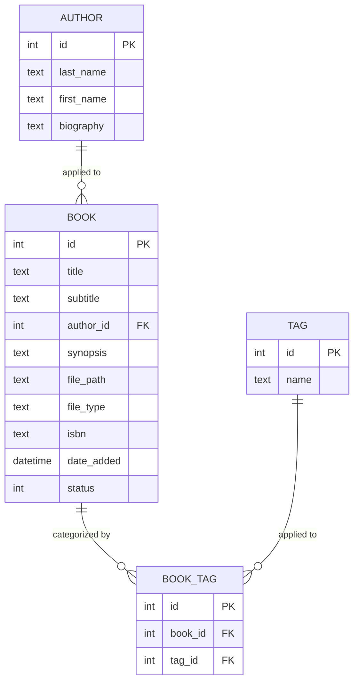
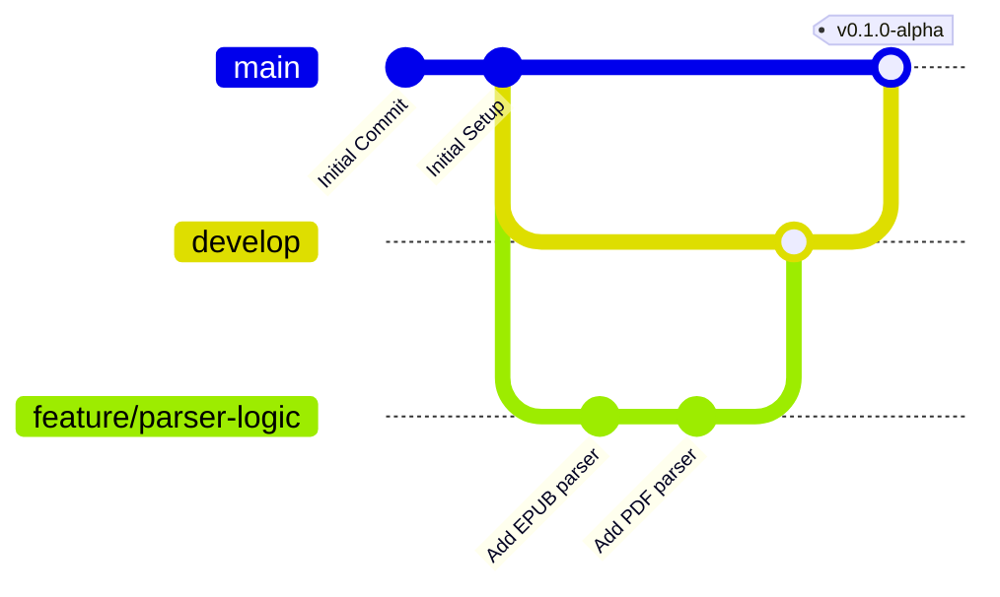

# lubrijo API
**A Headless Metadata Engine for EPUB/PDF Library Management.**
_now in full-Esperanto_

## Vision
**librujo** (esperanto for 'library') is a lightweight, local-first REST API designed to organize large-scale document collections (.epub, .pdf). It prioritizes data integrity and system observability, moving away from bloated library managers toward a "Bare-Metal" data layer.

## Tech Stack
- **Language:** Python 3.12+
- **Framework:** FastAPI
- **Database:** SQLite (SQLAlchemy ORM)
- **Parsing:** EbookLib (EPUB), PyMuPDF (PDF)
- **Interface:** Future TUI (Textual/Rich)

## Current Layout
### ER-Diagram

### Git Progress ([see full diagram](#))

## Project Milestones
For a more precise status report on the library, visit [the Backlog](https://github.com/users/PonchoIMa/projects/1)
- [ ] Phase 1: File System Ingestion & Metadata Extraction
- [ ] Phase 2: SQLite Schema Implementation
- [ ] Phase 3: REST API Endpoint Development
- [ ] Phase 4: TUI Client for Terminal Management
